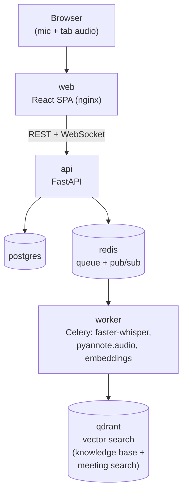

<p align="center">
  <picture>
    <source media="(prefers-color-scheme: dark)" srcset="web/src/assets/logo-dark.svg" />
    
  </picture>
</p>

# Corella

A self-hosted meeting assistant: it records a call from your browser (or takes an upload), transcribes and speaker-labels it, keeps a live AI copilot grounded in your own documents, and turns the call into a searchable transcript plus a post-call summary and coaching report. Runs entirely on your own Linux box via Docker Compose — your own database, your own vector store, and (optionally) your own local LLM, with no required cloud dependency beyond whichever hosted LLM/STT provider you choose to connect.

## Features

- **Live in-browser recording** — captures your mic and, optionally, a shared browser tab's audio, transcribing both sides as the call happens.
- **Upload-based transcription** — drop in an existing recording (most common audio formats, incl. `.caf`) for the same pipeline, offline.
- **Speaker separation, live** — more than one voice on your own mic (an in-person meeting around one laptop) or on the shared tab audio gets split into "Speaker 1"/"Speaker 2" / "Them 1"/"Them 2" mid-call, not just after the fact.
- **Cross-meeting voice recognition** — enroll your voice once and Corella recognizes you (and, within a group, your teammates) across future calls; unrecognized speakers get identified live from what they say ("Hi, this is Lucas") via your configured LLM.
- **Pluggable speech-to-text** — local `faster-whisper` by default (zero config), or Deepgram if you connect an API key — per-user, per-provider model overrides available in Settings.
- **Pluggable copilot LLM** — Anthropic, OpenAI, Gemini (bring your own key), or a self-hosted Ollama instance — live suggestions, blockers, action items, and a live coach score during the call.
- **Post-call reports** — auto-generated the moment a call finishes: title, summary, key topics, sentiment, notable quotes, action items, talk ratio, and a coach score, tuned by call type (sales/support/interview/1:1/meeting).
- **Knowledge base** — upload your own documents; the live copilot retrieves relevant snippets via semantic search.
- **Semantic search** — across your own meeting history, across your group's shared reports, or (as an admin) system-wide.
- **Groups** — a shared knowledge base and shared voice recognition across teammates, with report-only (not raw transcript) visibility into a group-mate's calls.
- **Admin console** — user/group management, and a cost-analytics dashboard (per-user spend, daily trend, a trailing-average 7-day projection) built from a real per-call LLM usage ledger.
- **Admin live debug panel** — while recording your own call as an admin, toggle a technical event stream (VAD flushes, STT/LLM request+response timing, diarization dispatch) for in-the-moment debugging.
- **Per-call cost estimate** — a best-effort running total per meeting, from real token usage where the provider reports it.

## Architecture



- **api** — FastAPI. Auth, meeting/KB/admin CRUD, WebSocket audio ingestion and live event push (transcript, copilot, diarization updates, admin debug events). Also runs `faster-whisper` directly for live transcription (it's torch-free, so it's light enough for this process) — everything torch-dependent (diarization, offline transcription's diarize step, voice-embedding extraction) stays worker-only.
- **worker** — Celery. Runs the heavier/blocking jobs: offline transcription + diarization for uploads, live periodic-reconciliation diarization and voice-identity matching, knowledge-base/meeting-search embedding, report generation, and voice enrollment — so none of it blocks the API process or the live WebSocket loop.
- **postgres** — structured data: users, groups, meetings, transcript segments, speakers, voice identities, action items, provider/STT credentials, per-call LLM usage ledger.
- **qdrant** — vector search, three collections: knowledge-base document chunks, meeting-transcript chunks (search), and speaker voice embeddings (cross-meeting recognition).
- **redis** — Celery broker/result backend, plus pub/sub for bridging worker-side events (diarization, live labels) back to the right live WebSocket connection.
- **web** — React/TypeScript SPA, built static and served by nginx.

The copilot LLM and the speech-to-text engine are each pluggable per user: a per-user saved key takes priority, then an instance-wide `.env` fallback, then — for STT only — local `faster-whisper`, which needs no key at all. See [`BRANDING.md`](BRANDING.md) for the UI's visual language if you're touching `web/`, or [`docs/AUDIO_PIPELINE.md`](docs/AUDIO_PIPELINE.md) for a detailed look at the transcription/live-streaming/speaker-diarization pipeline — including the full decision flow and the real bugs that shaped it — if you're touching `app/services/vad/`, `app/services/diarization/`, `app/services/asr/`, `app/ws/live_session.py`, or `app/workers/tasks.py`.

### Tech stack

| | |
|---|---|
| Backend | Python, FastAPI, SQLAlchemy 2 (async) + Alembic, Celery |
| Speech/ML | faster-whisper, Deepgram (optional), pyannote.audio (diarization + speaker embeddings), sentence-transformers / fastembed (KB + meeting search embeddings) |
| LLM clients | Hand-rolled `httpx` clients for Anthropic, OpenAI, Gemini, Ollama — no SDK dependency |
| Data | PostgreSQL, Qdrant (vectors), Redis (broker + pub/sub) |
| Frontend | React, TypeScript, Vite, Tailwind CSS, react-router |
| Infra | Docker Compose (CPU-first; optional NVIDIA override) |

### Repository layout

```
corella/
  server/
    app/
      api/          REST routers — auth, meetings, kb, settings, admin
      ws/            WebSocket live-session handler
      core/          config, security (JWT + secret encryption), db sessions
      models/        SQLAlchemy models
      schemas/       Pydantic request/response schemas
      services/
        asr/          faster-whisper + Deepgram clients, provider resolution
        diarization/   pyannote.audio wrapper, online speaker clustering
        alignment/     merges ASR output + diarization into labeled utterances
        llm/           provider clients (anthropic/openai/gemini/ollama) + resolution
        embeddings/    sentence-transformers/fastembed + Qdrant collections
        copilot/       live suggestions, post-call report generation
        admin/         cost-analytics aggregation
        audio/         WAV I/O, channel mixing/windowing
        vad/           speech/silence utterance detection
      workers/       Celery task definitions
      main.py
    alembic/          DB migrations
  web/
    src/
      routes/         one file per screen (Dashboard, MeetingDetail, LiveSession, Settings, Admin, …)
      components/      shared UI (AppShell, …)
      lib/             typed API client, live-session WS client, auth context
    public/
  docker-compose.yml         CPU-first stack
  docker-compose.gpu.yml     optional NVIDIA runtime override
  .env.example
  BRANDING.md                UI visual language + component conventions
  VERSIONING.md              three-digit version guide — when to bump what
  docs/
    AUDIO_PIPELINE.md        transcription/live-streaming/diarization deep dive
```

## Running it

```bash
cp .env.example .env   # fill in JWT_SECRET at minimum
docker compose up --build
```

- Web UI: http://localhost:8080
- API: http://localhost:8000 (docs at `/docs`)

If you have an NVIDIA GPU + the NVIDIA Container Toolkit installed, layer on the GPU override for faster/larger transcription and diarization models:

```bash
docker compose -f docker-compose.yml -f docker-compose.gpu.yml up --build
```

### Deploying an update

```bash
docker compose build api worker web
docker compose up -d api worker web
```

Migrations run automatically on `api` startup. `postgres`/`redis`/`qdrant` don't need rebuilding for an app-code change.

## Configuration

See [`.env.example`](.env.example) for the full, documented list. Highlights:

- **Core**: `JWT_SECRET` (required), `CORS_ORIGINS`, `ENVIRONMENT`.
- **Access control**: `ALLOW_PUBLIC_REGISTRATION`, `ADMIN_EMAIL`/`ADMIN_PASSWORD` (bootstrap admin, see [Access control](#access-control) below).
- **Data stores**: `DATABASE_URL`, `REDIS_URL`, `QDRANT_URL` — defaults match `docker-compose.yml`'s service names, only change these if you're pointing at externally-hosted stores.
- **Speech**: `HF_TOKEN` (diarization, see below), `WHISPER_MODEL`/`WHISPER_COMPUTE_TYPE`, optional `DEEPGRAM_API_KEY`/`DEFAULT_MODEL_DEEPGRAM`.
- **Storage**: `AUDIO_STORAGE_PATH`/`MAX_AUDIO_UPLOAD_MB`, `KB_STORAGE_PATH`/`MAX_KB_UPLOAD_MB`, `EMBEDDING_MODEL`.
- **LLM providers** (all optional instance-wide fallbacks — every provider is also configurable per-user in Settings): `ANTHROPIC_API_KEY`, `OPENAI_API_KEY`, `GEMINI_API_KEY`, `OLLAMA_BASE_URL`.

Every credential (LLM and STT alike) follows the same precedence: the signed-in user's own saved key first, then the instance-wide `.env` value, and — for speech-to-text specifically — local `faster-whisper` as a final, always-available fallback that needs no key at all. A user can also pin an explicit provider/model/language override in Settings instead of relying on that automatic priority order.

### Speaker diarization setup

Speaker diarization uses a gated `pyannote.audio` pipeline. A valid `HF_TOKEN` alone isn't enough — the Hugging Face account behind it must also individually accept the terms on **each** gated model page the pipeline depends on internally (a separate, one-time click-through per repo):

- https://huggingface.co/pyannote/speaker-diarization-3.1
- https://huggingface.co/pyannote/segmentation-3.0
- https://huggingface.co/pyannote/speaker-diarization-community-1

Skipping this doesn't break anything — transcription still works fine and the meeting still finishes, just without speaker labels for uploaded/offline recordings; the pipeline just fails per-file with a clear error in the worker logs instead of loading. Live diarization during a recording uses the same gated pipeline for its embedding model, so it's subject to the same requirement — a session without it just skips live labeling and keeps showing "Me"/"Them".

## Recording a meeting

Two ways to get a meeting transcribed, both going through the same pipeline downstream:

- **Upload**: on the Dashboard, "Upload recording" picks an audio file (most common formats, incl. `.caf`), which is transcribed — and, if `HF_TOKEN`'s terms are accepted, speaker-diarized — in the background. The meeting page polls and updates itself as processing finishes, and a summary report generates automatically once it's ready.
- **Live recording**: "Record live" captures your mic (and, optionally, a shared browser tab's audio) directly in the browser, transcribing each side as it happens, with live AI copilot suggestions (if an LLM provider is connected) and live speaker separation on both channels. Stopping finalizes the recording the same way an upload does — including the automatic report.

Speech-to-text uses whichever engine is currently resolved for the recording user (Deepgram if configured, else local) — see [Configuration](#configuration) above for the precedence, or Settings' "AI models in use" panel to see and change what's active.

## Access control

By default anyone can create their own account (`ALLOW_PUBLIC_REGISTRATION=true`). For an admin-managed instance:

1. Set `ADMIN_EMAIL` / `ADMIN_PASSWORD` in `.env` — that account is created automatically on first startup with the `admin` role.
2. Set `ALLOW_PUBLIC_REGISTRATION=false` to close self-serve sign-up.
3. Sign in as the admin and manage users/groups from the **Admin** page in the UI (or `POST /api/admin/users` / `/docs` directly).

`ADMIN_EMAIL`/`ADMIN_PASSWORD` only ever *create* the account — changing them later and restarting won't touch an existing admin's password.

Admins additionally get read-only access to every user's full transcript/audio (not just group-mates' reports) via a dedicated "All meetings" view, and a cost-analytics dashboard aggregated across the whole instance. Every write path (delete, report generation, action-item edits) stays strictly owner-only regardless of role.

## Design & branding

The UI follows a deliberate, documented visual language — see [`BRANDING.md`](BRANDING.md) for the full color/type/component reference before making frontend changes. In short: near-white/charcoal surfaces, a single navy accent, a serif for headlines only, border-first cards with minimal shadow.

## Development

Contributing? See [`CONTRIBUTING.md`](CONTRIBUTING.md) for setup, this project's conventions (credential handling, migrations, adding a new LLM/STT provider), and what a good PR looks like here — and [`VERSIONING.md`](VERSIONING.md) for which digit to bump on a `main` → `release` cut.

Backend:

```bash
cd server
pip install -e ".[worker]"
alembic upgrade head
uvicorn app.main:app --reload
```

Frontend:

```bash
cd web
npm install
npm run dev
```

Type-check and build the frontend before committing:

```bash
cd web
npx tsc -b && npx vite build
```

A backend `pytest` suite (`server/tests/`) covers the highest-value logic — permission boundaries, credential/provider resolution, webhook templating, pricing math — not every endpoint; growing it is a welcome contribution. `ruff` and `pytest` are both required checks on any PR into `main`/`release`, and `ruff` alone runs on every push for fast feedback (`.github/workflows/`). Frontend correctness is still `tsc -b` + `vite build`, no component-test suite yet. Beyond what's covered by these, changes are verified by hand against a real, isolated Docker stack (see `CONTRIBUTING.md` and any recent commit message for the pattern) — several real bugs in this project's history were only ever caught that way, not by a unit test.

## Status

Actively developed. Done so far: auth and admin-managed accounts with groups, upload and live in-browser recording with speaker-labeled transcripts, pluggable LLM copilot (live suggestions/blockers/action items/coach score) and pluggable STT (local or Deepgram), knowledge-base ingestion and semantic meeting search, auto-generated post-call reports (summary/topics/sentiment/quotes/coach score) tuned by call type, cross-meeting voice recognition with live LLM name-spotting, live same-room and same-tab speaker separation, an admin console (users/groups/cost analytics) plus a live debug panel, and per-call cost tracking against a real usage ledger.

Not yet built: post-call "polish" re-transcription with a larger model, and an automated test suite.

## License

[Apache License 2.0](LICENSE).
