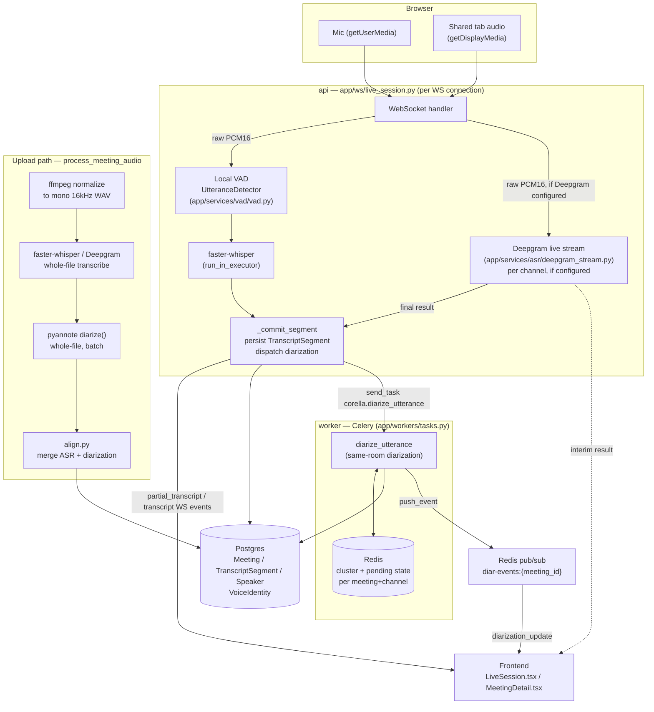
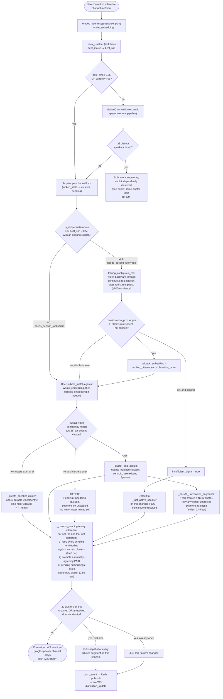

# The audio pipeline: transcription, live streaming, and speaker diarization

This document explains how Corella turns raw microphone/tab audio into a
speaker-labeled transcript, both live and for uploads — and, in detail, the
speaker-diarization system specifically, because it went through several
real, hard-won iterations before it worked reliably. If you're touching
`app/services/vad/`, `app/services/diarization/`, `app/services/asr/`,
`app/ws/live_session.py`, or `app/workers/tasks.py`, read this first.

## Contents

- [End-to-end flow](#end-to-end-flow)
- [Component map](#component-map)
- [Live ingestion: VAD, rolling preview, STT](#live-ingestion-vad-rolling-preview-stt)
- [Speaker diarization](#speaker-diarization)
  - [Two separate mechanisms](#two-separate-mechanisms)
  - [Within-utterance splitting](#within-utterance-splitting)
  - [Cross-utterance online clustering (the hard part)](#cross-utterance-online-clustering-the-hard-part)
  - [Full decision flow](#full-decision-flow)
- [The debugging history](#the-debugging-history)
- [Debugging tools](#debugging-tools)
  - [Content-addressed caching for `--chunker deepgram`](#content-addressed-caching-for---chunker-deepgram)
- [Tunables reference](#tunables-reference)
- [Known open issues](#known-open-issues)

## End-to-end flow

Two ways audio gets into the system — a live browser recording, or an
uploaded file — that converge on the same transcript/speaker data model.



The upload path (bottom-left) runs once, on a whole already-finished file —
no live/incremental concept applies there at all, which is why it's a
straight line rather than the branching decision tree the live path uses.
Both paths land in the same `TranscriptSegment`/`Speaker` tables, so
`MeetingDetail.tsx`'s post-call view needs zero special-casing for how a
meeting was captured.

## Component map

| Concern | File(s) |
|---|---|
| VAD / utterance boundary detection (local) | `app/services/vad/vad.py` |
| Live WS session state machine, dispatch | `app/ws/live_session.py` |
| Deepgram live streaming client | `app/services/asr/deepgram_stream.py` |
| Deepgram prerecorded (uploads) | `app/services/asr/deepgram.py` |
| Local whisper (both live and uploads) | `app/services/asr/whisper.py` |
| STT/LLM provider resolution | `app/services/asr/resolve.py`, `app/services/llm/resolve.py` |
| Speaker-embedding extraction | `app/services/diarization/embedding.py` |
| Full pyannote pipeline (within-utterance splits, offline diarization) | `app/services/diarization/pyannote.py` |
| Online clustering (cross-utterance identity) | `app/services/diarization/cluster.py` |
| Worker task orchestration (the decision logic) | `app/workers/tasks.py` — see `diarize_utterance` |
| Worker → live WS event bridge | `app/services/diarization/events.py`, `live_session.py:_poll_diarization_updates` |
| Cross-meeting/group voice identity | `app/models/voice_identity.py`, `app/services/embeddings/qdrant_store.py` (`speaker_embeddings` collection) |
| Audio mixing/windowing/WAV I/O | `app/services/audio/mixing.py` |
| Debugging tools (this session's additions) | `server/scripts/diarize_debug.py`, `server/scripts/verify_production_diarize.py` |

## Live ingestion: VAD, rolling preview, STT

Every incoming audio chunk on a channel (`me` or `them`) is fed through one
of two paths:

- **Local VAD + whisper** (`UtteranceDetector` in `vad.py`): buffers audio,
  flags speech/silence per 30ms frame, and flushes a completed "utterance"
  once it sees `SILENCE_TO_FLUSH_MS` (500ms) of trailing silence, or a
  `live_max_utterance_seconds` (12s) safety cap for continuous speech. A
  **rolling preview** re-decodes the still-accumulating buffer roughly every
  second (self-pacing to `2×` the last decode's own duration, so an
  overloaded CPU backs off rather than queuing decodes it can't keep up
  with) and pushes it as a disposable `partial_transcript` event — replaced
  by the real committed segment once the pause actually lands.
- **Deepgram live streaming** (`deepgram_stream.py`), when the resolved STT
  provider for the session is Deepgram: raw PCM streams directly to
  Deepgram's own WS endpoint, no local VAD gating at all — Deepgram does its
  own endpointing. Interim results become `partial_transcript` events, final
  results (`speech_final`) become committed segments through the exact same
  `_commit_segment` function the local path uses. Per-channel: if a
  channel's socket fails or drops mid-session, only that channel falls back
  to local VAD/whisper for the rest of the session — the healthy channel is
  untouched.

Either way, a committed segment triggers the same downstream step:
same-room diarization dispatch (`me`/`them` only — `Channel.UNKNOWN` never
reaches this WS path at all).

## Speaker diarization

### Two separate mechanisms

Corella never runs pyannote's full `SpeakerDiarization` pipeline on live
audio in real time — it's a whole-file batch API with no notion of "here's
one more utterance, update your answer," and it's unreliable on anything
under ~10 seconds of audio (verified empirically: an isolated ~4-6s clip
either missed a real speaker change entirely or produced garbage
overlapping turns). Instead there are two distinct mechanisms, used for two
different questions:

1. **Within-utterance splitting** — "did the speaker change *inside* this
   one committed utterance?" (e.g. someone interrupts mid-sentence). Uses
   the real pyannote pipeline, but only on a wider windowed slice, and only
   when there's reason to think it's needed.
2. **Cross-utterance online clustering** — "which already-known speaker is
   *this whole utterance*, or is it someone new?" A cheap speaker-embedding
   model (`pyannote/wespeaker-voxceleb-resnet34-LM`, not gated) plus
   cosine-similarity clustering, updated incrementally per meeting+channel.
   **This is the mechanism that had the hard bugs** — see
   [The debugging history](#the-debugging-history).

### Within-utterance splitting

Before even considering a split, two conditions skip the expensive full
pipeline entirely and send the utterance straight to clustering as one
whole: the whole-utterance embedding already confidently matches an
existing cluster (`≥ diarization_skip_confidence`, 0.65 — inside the real
measured same-speaker range of 0.67-0.75, with margin), or the accumulated
context window is under 9 seconds (pyannote's own reliability floor,
verified empirically). Otherwise `diarize()` runs on the windowed audio
(`diarization_context_window_ms` = 12000ms of already-received same-channel
audio, ending at the utterance's own end), turns are clipped to the
utterance's own span, adjacent same-label turns are merged, and — only if
**2 or more** distinct local speakers remain after merging — the utterance
is split into multiple `TranscriptSegment` rows, each independently
embedded and clustered.

### Cross-utterance online clustering (the hard part)

This is a per-meeting, per-channel online clustering process. State lives
in Redis (`diar:{meeting_id}:{channel}`), guarded by a lock
(`diar-lock:{meeting_id}:{channel}`) so two utterances dispatched close
together can't both decide "new speaker" for what's actually the same one.

Core data structure (`app/services/diarization/cluster.py`):

```python
@dataclass
class Cluster:
    centroid: list[float]  # running average embedding
    count: int              # how many utterances fed this cluster
    speaker_id: str          # Speaker.id
```

`best_match(clusters, embedding)` returns the closest cluster and its
cosine similarity (or `(None, -1.0)` if there are no clusters yet).
`SIMILARITY_THRESHOLD = 0.55` is the "is this the same person at all" bar —
calibrated against real recorded conversation (not synthetic TTS, which
this specific embedding model doesn't discriminate at all): same-speaker
similarity clustered at 0.67–0.75, different-speaker at 0.01–0.14, a wide
clean gap this threshold sits comfortably inside.

**The problem this whole system exists to solve**: a *short* utterance's
embedding is genuinely noisy. A real same-speaker 0.5s clip scored 0.53
against its own true speaker — just under threshold, a real near-miss.
Deepgram's own endpointing (tuned for natural-feeling transcription
chunking, not speaker-identity signal strength) produces many more, shorter
utterances than local VAD did — so this noise floor gets hit constantly in
real usage, and every miss used to permanently mint a new spurious
"Speaker N".

### Full decision flow



Key design decisions worth calling out explicitly:

- **Embeddings are always extracted before the lock is acquired.** A cold
  model load can take several seconds; doing it while holding
  `locked_state`'s lock once outlasted the lock's own 10s timeout, auto-
  expiring it mid-hold and raising `redis.exceptions.LockNotOwnedError` on
  release. Only the fast read-decide-write step happens inside the lock.
- **`trailing_contiguous_ms` widens through continuous speech but stops at
  the first real pause** — deliberately, not a fixed duration. A naive
  fixed-duration widen was tried first and rejected: it blended a
  *different* speaker's audio across a real pause into one embedding,
  which then confidently (0.775 similarity) matched the wrong cluster.
  Capping at the previous committed segment's own boundary was tried next
  and also rejected: it collapses to zero extra context whenever
  utterances are dispatched back-to-back with no gap — the common case
  this mechanism exists for in the first place.
- **A deferred (`PendingEmbedding`) utterance can never single-handedly
  create a new cluster.** Only two pending embeddings *mutually agreeing*
  with each other can. Deferring without this was tried and found
  structurally broken: it can never form a second cluster once a first one
  exists (see [the debugging history](#the-debugging-history)) — a real
  2-speaker file collapsed to 1 cluster, silently erasing the second
  speaker.
- **Never a blind "default to last speaker" guess** for a low-confidence
  match. Tried once, rejected: it misattributed a genuinely different
  speaker's utterance to the wrong existing one — a **false merge**, judged
  worse than the over-segmentation it was meant to fix, because it
  permanently blends two real people's words together. `insufficient_signal`
  is the one narrow exception (clipped audio that even corroboration
  couldn't rescue), and even there it only ever *reuses* an already-real
  speaker, never invents one.

## The debugging history

Speaker diarization went through five real, distinct rounds before it
worked reliably on natural conversational audio. Summarized here because
each rejected design taught something the current one depends on — if
you're tempted to simplify this system, read what already failed first.

1. **Phase F / F-2 (original build)**: online clustering + within-utterance
   splitting, both built and verified against real ground-truth audio
   through local VAD's utterance boundaries (long, clean, pause-bounded
   chunks). Worked well — because local VAD's `SILENCE_TO_FLUSH_MS`-gated
   chunking happened to produce long, low-noise embeddings.

2. **Phase U (Deepgram live streaming)**: swapping in Deepgram's own
   endpointing for live transcription made transcription feel faster and
   more natural, but produced many more, much shorter utterances for the
   same real conversation — a real regression, not identified until the
   user reported "8 speakers for 2 real people."

3. **Phase V (first fix attempt)**: added a content/clipping-based
   "needs a second, wider-window look" trigger (`is_clipped`,
   `speech_ms` vs a thinness floor) plus the pause-aware
   `trailing_contiguous_ms` corroboration widening. Fixed the clipped-audio
   case and some short-utterance cases. **Verified against `audio-3.wav`
   at the time — but that file didn't happen to reproduce the dominant
   real-world failure mode**, so the fix shipped looking complete when it
   wasn't.

4. **This session, round 1**: built a standalone local debug harness
   (`scripts/diarize_debug.py`) specifically so real audio could be
   iterated on without a Docker rebuild loop, then used it against a real
   Deepgram prerecorded call (reproducing actual production chunking) on
   the user's own real failing recordings. Found the real remaining bug:
   the "needs a second look" trigger was gated on content *thinness* only —
   a **normal-length** utterance (1.5-2s of real speech) could still score
   just under 0.55 from ordinary embedding variance, and since it wasn't
   thin, no second look was ever attempted. **Fixed**: broadened the
   trigger to "any miss against an existing cluster," not just thin ones.
   Shipped, verified safe on all 4 real samples with zero regressions.

5. **This session, round 2**: kept digging per the user's request. Found
   that even the broadened trigger wasn't enough — a weak utterance whose
   corroboration attempt *also* failed to confidently match still
   instantly minted a new speaker. Tried **deferring** those instead of
   guessing (leave unresolved, retry against cluster state on every later
   utterance) — and found this alone was **structurally broken**: since a
   deferred embedding could only ever be matched against clusters that
   *already exist*, no second cluster could ever form once a first one
   did. On real 2-speaker ground truth, this silently collapsed both test
   files down to 1 cluster each — erasing the second speaker entirely,
   worse than the bug it was meant to fix. The actual fix: a new cluster
   can still form from a deferred embedding, but only once it's
   **corroborated by a second, independently-deferred embedding that
   mutually agrees with it** (`try_promote_mutual_pair`, 0.55 bar) — real
   evidence from two utterances, not one weak score trusted alone. Verified
   twice: once in the harness (no DB/Redis), then again against the actual
   production `diarize_utterance` task function directly (real
   Postgres/Redis/Qdrant — see `scripts/verify_production_diarize.py`).
   Both real 2-speaker files produced exactly 2 Speaker rows; both real
   1-speaker files produced exactly 1 — matching ground truth.

One issue was found and deliberately **not** fixed this round — the
existing corroboration mechanism can still blend two different real
speakers when their natural pause is under `SILENCE_TO_FLUSH_MS` (500ms).
See [Known open issues](#known-open-issues).

## Debugging tools

Two scripts, both under `server/scripts/`, built specifically so
diarization behavior can be iterated on with real audio without a Docker
rebuild loop:

- **`diarize_debug.py`** — a standalone, no-DB/no-Redis replay of the
  `diarize_utterance` decision flow against a real WAV file. Clusters are
  tracked in a plain in-memory list across utterances — the same clustering
  math (`best_match`/`update_centroid`) real production code uses, just not
  the surrounding persistence plumbing. Two chunking modes:
  `--chunker vad` (local webrtcvad, matching what a local-whisper session
  produces) or `--chunker deepgram` (a real, cached Deepgram prerecorded
  call — reproduces actual production endpointing). Prints every
  utterance's decision (skip-confidence, second-look trigger, corroboration
  outcome, defer/promote/backfill) plus a final summary of how many
  speakers were created and why. Run it directly:

  ```bash
  cd server
  .venv/bin/python scripts/diarize_debug.py ../audio-samples/some-call.wav --chunker deepgram
  ```

  Its own module docstring tracks current status — which fixes are shipped,
  which hypotheses were tried and rejected (with the real numbers that
  rejected them), and what's still open.

- **`verify_production_diarize.py`** — the real end-to-end check: creates a
  real throwaway User/Meeting/TranscriptSegment set and calls the actual
  `diarize_utterance` Celery task function directly (in-process, no broker
  round-trip needed) against real isolated Postgres/Redis/Qdrant. Use this
  before trusting any change the harness alone can't fully validate (this
  fix touches Redis-persisted state — `PendingEmbedding`, the extended
  `locked_state` shape — that the DB/Redis-free harness deliberately can't
  exercise). See the script's own docstring for the isolated-infra setup
  (throwaway Postgres/Redis/Qdrant containers + a throwaway container from
  the already-built `corella-worker:latest` image with local code
  bind-mounted read-only, so code edits are picked up on `docker restart`
  without a slow image rebuild).

### Content-addressed caching for `--chunker deepgram`

Debugging real over-segmentation needed *real* Deepgram chunking — a
synthetic or local-VAD approximation wouldn't reproduce the actual
utterance boundaries production traffic gets, which is exactly what this
whole investigation turned on. But a real fix-hypothesis session runs the
harness against the same handful of audio files repeatedly (once per
candidate fix, sometimes several times per file while narrowing in), and
Deepgram's `/v1/listen` response — the utterance list this whole exercise
is built on — is fully determined by the audio bytes and request params.
Re-sending the same file to Deepgram on every run is pure waste: it costs
real money, adds real network latency to every iteration, and buys nothing
the first response didn't already answer.

`chunk_via_deepgram()` hashes the input audio (`sha256`, first 16 hex
chars) and caches the raw JSON response under
`server/scripts/.deepgram_cache/{hash}.json`, keyed purely by content — the
same audio bytes always resolve to the same cache entry regardless of
filename, so renaming or copying a sample doesn't invalidate it, and two
different samples never collide. A cache hit skips the network call
entirely and prints which cache file it used; a miss makes the real call
once and writes the response before returning it. This is why the dozen-plus
harness runs during this investigation only ever hit Deepgram's real API
once per distinct audio file, not once per run — the fix-hypothesis
iteration loop (change a threshold, re-run all 4 samples, compare) went
from "a real network round-trip every time" to "instant after the first
run," without ever risking a stale or synthetic chunking result standing
in for the real thing.

The cache directory is git-ignored (`.gitignore`) — it holds real
transcript content from real audio, not something to commit — and is
disposable: delete it any time to force fresh calls (e.g. after a model or
`language` param change that would actually produce different chunking).

## Tunables reference

All in `app/core/config.py` unless noted; see each setting's own docstring
in that file for the full empirical justification.

| Setting | Value | What it governs |
|---|---|---|
| `SIMILARITY_THRESHOLD` (`cluster.py`) | 0.55 | "Is this the same person at all" — the core clustering bar. |
| `diarization_skip_confidence` | 0.65 | Above this, skip the expensive within-utterance `diarize()` pass entirely. |
| `diarization_context_window_ms` | 12000 | How much already-received audio backs the within-utterance split pass. |
| `diarization_corroboration_window_ms` | 3000 | Upper cap on how far `trailing_contiguous_ms` is allowed to widen. |
| `diarization_corroboration_min_speech_ms` | 1000 | How much real speech a corroboration window needs before it's trusted. |
| `diarization_backfill_similarity_threshold` | 0.45 | Lenient bar for retroactively resolving an unlabeled/pending segment. |
| `SILENCE_TO_FLUSH_MS` (`vad.py`) | 500 | Local VAD's own utterance-boundary pause threshold; also what `trailing_contiguous_ms` treats as "a real pause" for corroboration purposes. |
| `live_max_utterance_seconds` | 12 | Safety cap forcing a flush on continuous pause-free speech (local-VAD path only). |

## Known open issues

- **Cross-speaker corroboration blending on short pauses.** The existing
  corroboration mechanism (`trailing_contiguous_ms`) widens through
  "continuous" speech and stops at the first gap ≥ `SILENCE_TO_FLUSH_MS`
  (500ms). Deepgram's own utterance gap between two *different* real
  speakers can be shorter than that in fast back-and-forth dialogue — when
  it is, corroboration widens straight across the boundary and can blend
  the wrong speaker's audio into the embedding. Reproduced on real
  ground-truth audio: a genuine speaker-B utterance ("Sí,") corroboration-
  matched into speaker A's cluster at 0.775. **Does not affect final
  speaker counts** (verified: both real 2-speaker test files still produce
  exactly 2 real Speaker rows) but can still mislabel an individual
  utterance in this scenario. A tighter global silence-gap threshold was
  tried and made things *worse* overall (broke other genuine same-speaker
  corroboration rescues that also happen to have short preceding pauses) —
  a real fix needs something smarter than one constant. Not yet found;
  tracked in `diarize_debug.py`'s own docstring.
- **Real-world "Them" tab-audio separability is unmeasured.** The
  same-room clustering numbers above (0.67–0.75 same-speaker, 0.01–0.14
  different-speaker) come from a clean single-microphone capture. A shared
  browser-tab/system-audio track (multiple remote participants already
  mixed by whatever call software produced it) is technically just another
  mono waveform to the same embedding model, but its real separability on
  a genuine multi-party call recording has never specifically been
  measured against ground truth.
- **No periodic cluster consolidation.** This system prevents *new*
  spurious clusters going forward; it doesn't retroactively merge clusters
  that were already spuriously split earlier in an in-progress call before
  a fix landed.
