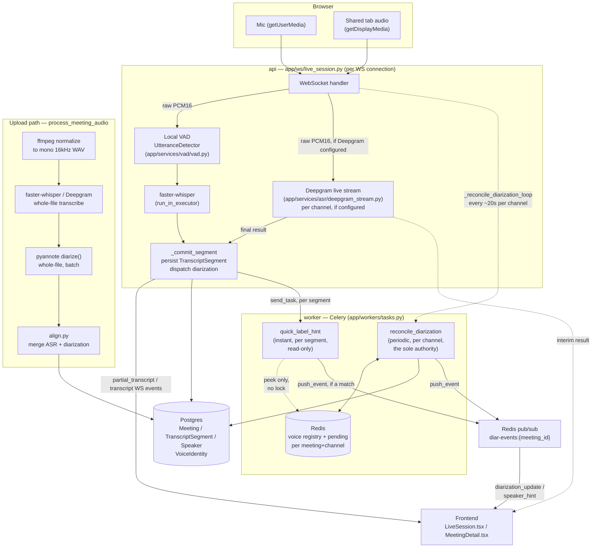

# The audio pipeline: transcription, live streaming, and speaker diarization

This document explains how Corella turns raw microphone/tab audio into a
speaker-labeled transcript, both live and for uploads — and, in detail, the
speaker-diarization system specifically, because it went through several
real, hard-won iterations before it worked reliably. If you're touching
`app/services/vad/`, `app/services/diarization/`, `app/services/asr/`,
`app/ws/live_session.py`, or `app/workers/tasks.py`, read this first.

## Contents

- [End-to-end flow](#end-to-end-flow)
- [Component map](#component-map)
- [Live ingestion: VAD, rolling preview, STT](#live-ingestion-vad-rolling-preview-stt)
- [Speaker diarization](#speaker-diarization)
  - [Two mechanisms: authoritative reconciliation + a fast recognition hint](#two-mechanisms-authoritative-reconciliation--a-fast-recognition-hint)
  - [The persistent voice registry](#the-persistent-voice-registry)
  - [The fast recognition hint](#the-fast-recognition-hint)
- [The debugging history](#the-debugging-history)
- [Debugging tools](#debugging-tools)
  - [Content-addressed caching for `--chunker deepgram`](#content-addressed-caching-for---chunker-deepgram)
- [Tunables reference](#tunables-reference)
- [Known open issues](#known-open-issues)

## End-to-end flow

Two ways audio gets into the system — a live browser recording, or an
uploaded file — that converge on the same transcript/speaker data model.



The upload path (bottom-left) runs once, on a whole already-finished file —
no live/incremental concept applies there at all, which is why it's a
straight line rather than the branching decision tree the live path uses.
Both paths land in the same `TranscriptSegment`/`Speaker` tables, so
`MeetingDetail.tsx`'s post-call view needs zero special-casing for how a
meeting was captured.

## Component map

| Concern | File(s) |
|---|---|
| VAD / utterance boundary detection (local) | `app/services/vad/vad.py` |
| Live WS session state machine, dispatch | `app/ws/live_session.py` |
| Deepgram live streaming client | `app/services/asr/deepgram_stream.py` |
| Deepgram prerecorded (uploads) | `app/services/asr/deepgram.py` |
| Local whisper (both live and uploads) | `app/services/asr/whisper.py` |
| STT/LLM provider resolution | `app/services/asr/resolve.py`, `app/services/llm/resolve.py` |
| Speaker-embedding extraction | `app/services/diarization/embedding.py` |
| Full pyannote pipeline (periodic reconciliation, offline diarization) | `app/services/diarization/pyannote.py` |
| Persistent voice registry (per meeting+channel) | `app/services/diarization/cluster.py` |
| Periodic reconciliation dispatch (live) | `app/ws/live_session.py` — `_reconcile_diarization_loop`, `_dispatch_reconciliation` |
| Worker task orchestration (the decision logic) | `app/workers/tasks.py` — see `reconcile_diarization` (authoritative) and `quick_label_hint` (fast, read-only) |
| Worker → live WS event bridge | `app/services/diarization/events.py`, `live_session.py:_poll_diarization_updates` |
| Cross-meeting/group voice identity | `app/models/voice_identity.py`, `app/services/embeddings/qdrant_store.py` (`speaker_embeddings` collection) |
| Audio mixing/windowing/WAV I/O | `app/services/audio/mixing.py` |
| Debugging tools | `server/scripts/verify_reconcile_diarization.py` (current); `server/scripts/diarize_debug.py`/`verify_production_diarize.py` (Phase V-era, per-utterance design — see [Debugging tools](#debugging-tools)) |

## Live ingestion: VAD, rolling preview, STT

Every incoming audio chunk on a channel (`me` or `them`) is fed through one
of two paths:

- **Local VAD + whisper** (`UtteranceDetector` in `vad.py`): buffers audio,
  flags speech/silence per 30ms frame, and flushes a completed "utterance"
  once it sees `SILENCE_TO_FLUSH_MS` (500ms) of trailing silence, or a
  `live_max_utterance_seconds` (12s) safety cap for continuous speech. A
  **rolling preview** re-decodes the still-accumulating buffer roughly every
  second (self-pacing to `2×` the last decode's own duration, so an
  overloaded CPU backs off rather than queuing decodes it can't keep up
  with) and pushes it as a disposable `partial_transcript` event — replaced
  by the real committed segment once the pause actually lands.
- **Deepgram live streaming** (`deepgram_stream.py`), when the resolved STT
  provider for the session is Deepgram: raw PCM streams directly to
  Deepgram's own WS endpoint, no local VAD gating at all — Deepgram does its
  own endpointing. Interim results become `partial_transcript` events, final
  results (`speech_final`) become committed segments through the exact same
  `_commit_segment` function the local path uses. Per-channel: if a
  channel's socket fails or drops mid-session, only that channel falls back
  to local VAD/whisper for the rest of the session — the healthy channel is
  untouched.

Same-room diarization is no longer triggered per committed segment — see
[Speaker diarization](#speaker-diarization) below for the periodic
reconciliation loop that replaced that dispatch.

## Speaker diarization

### Two mechanisms: authoritative reconciliation + a fast recognition hint

Corella never runs pyannote's full `SpeakerDiarization` pipeline on a single
short utterance in real time — it's unreliable on anything under ~10
seconds of audio (verified empirically: an isolated ~4-6s clip either
missed a real speaker change entirely or produced garbage overlapping
turns), and a short/noisy embedding from one Deepgram-chopped utterance is
*structurally* unable to safely decide "is this a new speaker" on its own
(see [The debugging history](#the-debugging-history) for the per-utterance
design this replaced, and why it kept breaking).

Instead there's a **periodic full diarization pass over a rolling window**
of already-received per-channel audio, reconciled against a persistent
per-channel voice registry, rather than ever clustering one utterance's own
embedding in isolation — adopted from a reference macOS app's own proven
live-diarization design (workflow inspiration only — this codebase, never
named). This pass is the sole authority: the only thing that ever creates a
new speaker, promotes a provisional one, or writes a label to Postgres.

- **Live dispatch** (`app/ws/live_session.py:_reconcile_diarization_loop`):
  every ~2s, checks each active channel (`me`/`them`); once a channel has
  accumulated at least `diarization_reconcile_min_window_ms` (12000ms) of
  audio and its own per-channel interval
  (`diarization_reconcile_interval_ms`, 20000ms) has elapsed, slices the
  last `diarization_reconcile_window_ms` (25000ms) of that channel's audio
  (`extract_channel_window`, reused as-is from the old design) and
  dispatches `corella.reconcile_diarization`. One more pass per channel is
  dispatched in `_drain_and_finalize`, after the loop itself is cancelled,
  to catch any trailing audio before the meeting finalizes.
- **The worker task** (`app/workers/tasks.py:reconcile_diarization`) runs
  the real `diarize()` pipeline once over the whole window, groups the
  resulting turns by local pyannote label, extracts one mean embedding per
  local label, and reconciles each against the channel's persistent
  registry — matching an existing entry or registering a new one,
  **claim-once per pass** (the busiest local voice claims first, so two
  real speakers active in the same window can never both match the same
  stored voice). Segments already committed in that window are relabeled
  by turn overlap — segments are never split or deleted by this mechanism
  (a real, accepted scope reduction from the old per-utterance design's
  mid-utterance splitting — see the note at the end of this section).

This pass alone was still not enough for a genuinely *live* feel — see
[The fast recognition hint](#the-fast-recognition-hint) below for the
second mechanism added in response to a real user report.

### The persistent voice registry

Still a per-meeting, per-channel structure in Redis
(`diar:{meeting_id}:{channel}`, guarded by `diar-lock:{meeting_id}:{channel}`
so two overlapping reconciliation passes can't double-claim it), but its
entries now carry more state than a single clustering decision needs:

```python
@dataclass
class Cluster:
    centroid: list[float]   # running average embedding
    count: int               # how many reconciliation passes fed this cluster
    weight_ms: int            # real, non-double-counted assigned speech time
    speaker_id: str | None     # None = provisional, not yet a real "Speaker N"/"Them N"
```

`best_match(clusters, embedding, exclude=...)` returns the closest
non-excluded cluster and its cosine similarity — the `exclude` set is what
implements claim-once matching within one pass. `SIMILARITY_THRESHOLD =
0.55` is unchanged from the old design and still the "is this the same
person at all" bar: same-speaker similarity clustered at 0.67–0.75 on real
recorded conversation, different-speaker at 0.01–0.14.

**`speaker_id is None` — a provisional entry — is the direct fix for the
regression this whole rebuild was for.** A registry entry doesn't get to
surface as a real "Speaker N"/"Them N" label purely because it clustered as
distinct from anything seen so far; it needs to hold real assigned speech
first (`meets_guest_floor`: `diarization_guest_min_ms`, 2000ms, **and**
`diarization_guest_min_share`, 8% of the channel's total tracked speech,
whichever is stricter — this app's version of the reference design's "guest
folding"; recalibrated down from the reference app's own starting 5000ms/10%
after a real production case — see
[The debugging history](#the-debugging-history)'s Phase W2 entry). Two
exemptions bypass the floor entirely: the very first voice
ever registered on a channel (nothing to compare it against yet), and any
voice recognized against the durable cross-meeting library (Phase O) — a
resolved identity is real information regardless of how little it's said
so far. A segment matched to a still-provisional entry is held in
`PendingSegment` (Redis, same list shape the old design's `PendingEmbedding`
used) until that entry either crosses the floor — every pending segment
pointing at it gets labeled at once — or the meeting ends still folded, in
which case it stays unlabeled (`MeetingDetail.tsx` already degrades that
gracefully, same as every other "no signal" case this app has always had).

**Why weight_ms is safe to compare against the floor despite overlapping
windows**: it's only ever incremented by a segment's own duration the first
time that segment is newly resolved (matched to a turn and either labeled
directly or added to `pending`) — never by raw window/turn duration, which
would double-count the same real speech across two passes whose 45-second
windows overlap by design. `count`/centroid updates, by contrast, happen on
*every* re-observation regardless of overlap — harmless, even desirable,
for centroid quality.

Segments a turn doesn't cover at all this pass are left alone, not guessed
at — the next pass's window will very likely include a turn for them as
more audio streams in, so there's no separate nearest-turn fallback the way
a one-shot design would need.

**Scope reduction, stated plainly**: the old per-utterance design could
split one committed `TranscriptSegment` into several when a genuine
speaker-change happened *inside* it (Phase F-2). This redesign doesn't —
segments keep their VAD/Deepgram-determined boundaries and only ever get
relabeled by overlap, never split. Deepgram's own aggressive endpointing
(the very thing that made per-utterance clustering unreliable — see
[The debugging history](#the-debugging-history)) already keeps individual
committed segments short in practice, so a single segment spanning a real
speaker change is rare with this STT path; if it turns out to matter,
segment splitting on ambiguous multi-turn overlap is a natural, contained
follow-up (the turns are already computed each pass — nothing new to
extract, just a decision to act on).

### The fast recognition hint

The periodic pass above is the only mechanism that decides anything new,
but it's a real `diarize()` call — measured at 6-33s of real worker CPU
time in production — on top of however much of its own
`diarization_reconcile_interval_ms` had already elapsed. A real user report
("it's not live at all, it only shows once I click Stop") traced directly
to this: on a short call, the *first* label often simply hadn't computed
yet by the time the call ended.

`corella.quick_label_hint` (`app/workers/tasks.py`), dispatched from
`app/ws/live_session.py:_commit_segment` the instant a segment commits, is
a fast, read-only shortcut for the common case — "the same person is still
talking":

1. Checks that the "2+ confirmed speakers" gate
   (`diar_events.has_reported_anything`) has already opened for this
   channel — the same gate `reconcile_diarization`'s own WS push respects,
   so a genuinely solo channel never gets a premature "Speaker 1" from
   this path either (verified live that skipping this check lets exactly
   that happen — see [The debugging history](#the-debugging-history)'s
   Phase W3 entry).
2. Extracts one cheap embedding (`embed_utterance`, not a full `diarize()`
   call) from just that segment's own audio.
3. Checks it against the channel's current registry with **no lock**
   (`peek_clusters` — a stale-by-one-pass read costs nothing worse than a
   slightly-delayed hint, never a wrong permanent write, since this path
   writes nothing).
4. If it confidently matches (`SIMILARITY_THRESHOLD`) a cluster that's
   already **promoted** (a real, confirmed `Speaker` row from an earlier
   reconciliation pass), pushes an advisory `speaker_hint` event — same
   wire shape as `diarization_update`, reusing the exact same Redis
   list/pub-sub bridge and the exact same frontend handling (`live.ts`
   dispatches both to `onDiarizationUpdate`). If it doesn't confidently
   match an already-promoted cluster — a genuinely new voice, or one still
   provisional — it does nothing at all, silently deferring to the real
   pass. It can never create a speaker, promote one, or touch Postgres.

This doesn't help the very first moments of a brand-new call (nothing's
been confirmed yet for a hint to recognize), but for every later utterance
by a voice the periodic pass has already confirmed, labeling goes from
"wait up to `diarization_reconcile_interval_ms` plus real compute time" to
"near-instant" — the majority of any real conversation once it's a few
turns in.

## The debugging history

Speaker diarization went through five real, distinct rounds before it
worked reliably on natural conversational audio. Summarized here because
each rejected design taught something the current one depends on — if
you're tempted to simplify this system, read what already failed first.

1. **Phase F / F-2 (original build)**: online clustering + within-utterance
   splitting, both built and verified against real ground-truth audio
   through local VAD's utterance boundaries (long, clean, pause-bounded
   chunks). Worked well — because local VAD's `SILENCE_TO_FLUSH_MS`-gated
   chunking happened to produce long, low-noise embeddings.

2. **Phase U (Deepgram live streaming)**: swapping in Deepgram's own
   endpointing for live transcription made transcription feel faster and
   more natural, but produced many more, much shorter utterances for the
   same real conversation — a real regression, not identified until the
   user reported "8 speakers for 2 real people."

3. **Phase V (first fix attempt)**: added a content/clipping-based
   "needs a second, wider-window look" trigger (`is_clipped`,
   `speech_ms` vs a thinness floor) plus the pause-aware
   `trailing_contiguous_ms` corroboration widening. Fixed the clipped-audio
   case and some short-utterance cases. **Verified against `audio-3.wav`
   at the time — but that file didn't happen to reproduce the dominant
   real-world failure mode**, so the fix shipped looking complete when it
   wasn't.

4. **This session, round 1**: built a standalone local debug harness
   (`scripts/diarize_debug.py`) specifically so real audio could be
   iterated on without a Docker rebuild loop, then used it against a real
   Deepgram prerecorded call (reproducing actual production chunking) on
   the user's own real failing recordings. Found the real remaining bug:
   the "needs a second look" trigger was gated on content *thinness* only —
   a **normal-length** utterance (1.5-2s of real speech) could still score
   just under 0.55 from ordinary embedding variance, and since it wasn't
   thin, no second look was ever attempted. **Fixed**: broadened the
   trigger to "any miss against an existing cluster," not just thin ones.
   Shipped, verified safe on all 4 real samples with zero regressions.

5. **This session, round 2**: kept digging per the user's request. Found
   that even the broadened trigger wasn't enough — a weak utterance whose
   corroboration attempt *also* failed to confidently match still
   instantly minted a new speaker. Tried **deferring** those instead of
   guessing (leave unresolved, retry against cluster state on every later
   utterance) — and found this alone was **structurally broken**: since a
   deferred embedding could only ever be matched against clusters that
   *already exist*, no second cluster could ever form once a first one
   did. On real 2-speaker ground truth, this silently collapsed both test
   files down to 1 cluster each — erasing the second speaker entirely,
   worse than the bug it was meant to fix. The actual fix: a new cluster
   can still form from a deferred embedding, but only once it's
   **corroborated by a second, independently-deferred embedding that
   mutually agrees with it** (`try_promote_mutual_pair`, 0.55 bar) — real
   evidence from two utterances, not one weak score trusted alone. Verified
   twice: once in the harness (no DB/Redis), then again against the actual
   production `diarize_utterance` task function directly (real
   Postgres/Redis/Qdrant — see `scripts/verify_production_diarize.py`).
   Both real 2-speaker files produced exactly 2 Speaker rows; both real
   1-speaker files produced exactly 1 — matching ground truth.

One issue was found and deliberately **not** fixed in round 2 — the
existing corroboration mechanism could still blend two different real
speakers when their natural pause was under `SILENCE_TO_FLUSH_MS` (500ms).

6. **Phase W (this rebuild): replaced the per-utterance design entirely.**
   Rounds 1-2 above kept the same core shape — cluster one utterance's own
   embedding, with increasingly careful heuristics bolted on to catch the
   cases where that embedding was too noisy to trust — and each round found
   a new case the previous one missed. Investigated how a reference macOS
   meeting-copilot app (workflow inspiration only) solved the identical
   problem: it never clusters one short utterance in isolation at all —
   instead it periodically re-runs full diarization over a rolling window
   of already-received audio and reconciles the result against a persistent
   voice registry, with a "guest folding" floor (real assigned talk-time,
   not just a clustering decision) before a freshly-seen voice earns a real
   label. Adopted that architecture directly (see
   [Speaker diarization](#speaker-diarization) above) — this is structurally
   immune to the short/noisy-embedding failure mode that rounds 1-2 were
   working around, rather than one more heuristic on top of it. The old
   per-utterance mechanism (`diarize_utterance`, `PendingEmbedding`,
   `try_promote_mutual_pair`, `trailing_contiguous_ms`, `is_clipped`'s
   diarization-specific caller, and every setting under
   `diarization_skip_confidence`/`diarization_corroboration_*`/
   `diarization_backfill_similarity_threshold`) was removed outright, not
   kept alongside the new one. Verified against the real production task
   function directly (`scripts/verify_reconcile_diarization.py`, same
   in-process/real-Postgres-Redis-Qdrant approach `verify_production_
   diarize.py` used for round 2): a real 60-second slice of real 2-speaker
   ground-truth audio, chopped into many short (~700ms) consecutive
   segments — deliberately simulating the aggressive-Deepgram-endpointing
   shape that produced the original "8 speakers for 2 real people" report —
   correctly produced exactly 2 real Speaker rows, not 8+. Also confirmed
   the guest-floor mechanism itself on a shorter (6s) window: a genuine
   second voice with only 2920ms of assigned speech correctly stayed
   provisional (held in `PendingSegment`, not labeled) — below the 5000ms
   absolute floor even though its *relative* share (49%) already cleared
   10%, exactly the intended "don't mint a label from a few seconds of
   evidence" behavior, not a bug.

This closed one issue from round 2 as a side effect (there's no longer a
`trailing_contiguous_ms` corroboration step for it to affect) and traded it
for a different, explicitly accepted one — see
[Known open issues](#known-open-issues).

7. **Phase W2: recalibrated the guest floor down after a real
   permanently-stuck case.** A user reported a live-recorded meeting still
   showing segments stuck at "Identifying…" in the post-call view. Traced
   directly against the real deployed data (not reproduced synthetically):
   a genuine second voice on a real ~1-minute call — 3430ms of real
   assigned speech across 2 real committed segments, not one noisy
   fragment — cleared neither the original 5000ms absolute floor nor the
   original 10% relative share (it measured 9.7%). Since no reconciliation
   pass ever revisits a meeting once its live session has ended, this
   wasn't "still catching up" — it was permanent; the segments could never
   have resolved no matter how long the frontend waited. Recalibrated
   `diarization_guest_min_ms`/`diarization_guest_min_share` down to
   2000ms/8% based on this one real measurement (still a single data
   point, not exhaustively tuned — flagged as such in
   [Known open issues](#known-open-issues)). Separately, confirmed the
   embedding-crash floor (`live_min_utterance_ms`, 300ms, Phase U's fix)
   still comfortably protects against a single spurious fragment at the
   new, lower guest floor — the two are independent safeguards, and
   lowering one didn't weaken the other.

   The frontend side of the same report also needed two real fixes, in
   `MeetingDetail.tsx`: (1) the post-call catch-up poll re-ran its full
   grace window on *every page load* regardless of how long ago the
   meeting had actually ended, replaying a spinner that could only ever
   end the same way for an old meeting — fixed by gating the poll on
   whether the meeting ended recently enough that the backend could
   plausibly still be working on it; an old meeting now shows its final
   state immediately. (2) An unresolved segment's fallback label was
   `"Me"`/`"Them"` — a confident, specific, and potentially wrong guess
   (this project already fixed the identical mistake once, for the
   still-catching-up case only; turned out the same risk existed in the
   give-up fallback too) — changed to the honest `"Unknown"`.

8. **Phase W3: added the fast recognition hint after "it's not live at
   all" feedback.** Correctness had been fully restored by Phase W (right
   speaker counts) and W2 (fewer permanently-stuck segments), but a direct
   user comparison against the reference macOS app's own live labeling
   made a real, separate gap obvious: periodic reconciliation alone, even
   working perfectly, still means every label waits on a real `diarize()`
   call — measured at 6-33s of real worker CPU time in production, on top
   of its own interval — so a short call could end before its first label
   ever computed. Investigated why the reference app doesn't have this
   problem: it turns out it uses the *identical* periodic-window
   architecture (its own numbers — 60s window, 30s interval, 12s minimum —
   are the same order of magnitude Corella's are), not a per-utterance-
   instant one; the real difference is that its full pass runs on
   CoreML/ANE hardware in low single-digit seconds, not CPU Python. Not a
   gap closeable by re-architecting — added `corella.quick_label_hint`
   instead (see [The fast recognition hint](#the-fast-recognition-hint)): a
   fast, read-only recognition check dispatched per segment, which can
   only ever repeat what an earlier reconciliation pass already decided,
   sooner — it never creates a speaker or writes to Postgres, so none of
   Phase W/W2's correctness guarantees are at risk. Also shrank
   `diarization_reconcile_window_ms`/`_interval_ms` (45000/25000 →
   25000/20000) based on the same production timing data, so even the
   *first* label of a call (which the hint can't help, since nothing's
   confirmed yet to recognize against) lands faster too.

   Verified live against the real deployed stack, not just reasoned about:
   streamed real 2-speaker audio for 100s+ and watched the raw WS events.
   One hint fired for real and worked exactly as intended — a segment
   labeled 2.3s after it committed, versus the ~43s it would have taken
   waiting for the periodic pass alone. But the same run caught a real bug
   before it could ship further: that one hint fired *before* the "2+
   confirmed speakers" gate (`has_reported_anything`) had ever opened for
   that channel — `quick_label_hint` was checking only "does a real
   Speaker row exist" (true the moment the very first voice on a channel
   auto-promotes, long before a second one is confirmed), not the separate
   gate that exists specifically so a genuinely solo channel never flashes
   a needless "Speaker 1". Fixed by making the hint path check the same
   gate the authoritative push already does — from then on every
   subsequent utterance from either confirmed speaker is fair game, but
   nothing reveals ahead of what the real mechanism itself would have
   allowed. Also observed directly: most hints in that same run correctly
   found nothing to say (silently deferring, as designed) for genuinely
   short utterances ("Sí.", "Podría ser") — the single embedding a hint
   checks is subject to the identical short-utterance noise Phase U/V/W
   already found and built the authoritative pass's extra care around;
   abstaining there and letting the real pass (with its actual acoustic
   context) handle it is correct, not a shortfall.

## Debugging tools

- **`verify_reconcile_diarization.py`** (current) — the real end-to-end
  check for the periodic-reconciliation design: creates a real throwaway
  User/Meeting, tiles a real WAV file into many short, gap-free
  `TranscriptSegment` rows (simulating aggressive Deepgram endpointing —
  the exact shape that caused the original regression), then calls the
  actual `corella.reconcile_diarization` Celery task function directly
  (in-process, no broker round-trip needed) against real isolated
  Postgres/Redis/Qdrant with a real, continuous slice of the source WAV as
  the window — exactly what `_reconcile_diarization_loop` would have
  sliced from `session.recordings` in production. Prints every segment's
  ground-truth label (if supplied via `--speaker-a`/`--speaker-b`) next to
  what the real code assigned, plus the final Redis registry state. Run it
  inside a throwaway container from the already-built `corella-worker:latest`
  image with local `app`/`scripts` bind-mounted read-only (so code edits
  are picked up on `docker restart`, no image rebuild needed) — see the
  script's own docstring for the exact isolated-infra setup (throwaway
  Postgres/Redis/Qdrant containers, real `HF_TOKEN`).

- **`diarize_debug.py`** / **`verify_production_diarize.py`** (Phase V-era,
  legacy) — built for the old per-utterance design (`diarize_utterance`,
  `PendingEmbedding`) this rebuild removed; their module docstrings still
  describe that design's decision flow accurately as history, but they no
  longer exercise any code path that exists in this codebase. Left in place
  as a record of that investigation rather than deleted outright — don't
  use them to validate current behavior.

### Content-addressed caching for `--chunker deepgram`

Applied to the legacy `diarize_debug.py` harness (see above) — kept here as
a documented technique in case a future debugging tool needs the same
approach, not as instructions for a tool current code still uses. Debugging
real over-segmentation needed *real* Deepgram chunking — a
synthetic or local-VAD approximation wouldn't reproduce the actual
utterance boundaries production traffic gets, which is exactly what this
whole investigation turned on. But a real fix-hypothesis session runs the
harness against the same handful of audio files repeatedly (once per
candidate fix, sometimes several times per file while narrowing in), and
Deepgram's `/v1/listen` response — the utterance list this whole exercise
is built on — is fully determined by the audio bytes and request params.
Re-sending the same file to Deepgram on every run is pure waste: it costs
real money, adds real network latency to every iteration, and buys nothing
the first response didn't already answer.

`chunk_via_deepgram()` hashes the input audio (`sha256`, first 16 hex
chars) and caches the raw JSON response under
`server/scripts/.deepgram_cache/{hash}.json`, keyed purely by content — the
same audio bytes always resolve to the same cache entry regardless of
filename, so renaming or copying a sample doesn't invalidate it, and two
different samples never collide. A cache hit skips the network call
entirely and prints which cache file it used; a miss makes the real call
once and writes the response before returning it. This is why the dozen-plus
harness runs during this investigation only ever hit Deepgram's real API
once per distinct audio file, not once per run — the fix-hypothesis
iteration loop (change a threshold, re-run all 4 samples, compare) went
from "a real network round-trip every time" to "instant after the first
run," without ever risking a stale or synthetic chunking result standing
in for the real thing.

The cache directory is git-ignored (`.gitignore`) — it holds real
transcript content from real audio, not something to commit — and is
disposable: delete it any time to force fresh calls (e.g. after a model or
`language` param change that would actually produce different chunking).

## Tunables reference

All in `app/core/config.py` unless noted; see each setting's own docstring
in that file for the full empirical justification.

| Setting | Value | What it governs |
|---|---|---|
| `SIMILARITY_THRESHOLD` (`cluster.py`) | 0.55 | "Is this the same person at all" — the core registry-matching bar. |
| `diarization_reconcile_window_ms` | 25000 | How much already-received per-channel audio one reconciliation pass looks at, trailing backward from "now". |
| `diarization_reconcile_interval_ms` | 20000 | How often a reconciliation pass runs per active channel — this is CPU-bound Python, not ANE-accelerated like the reference app's. |
| `diarization_reconcile_min_window_ms` | 12000 | Below this much accumulated per-channel audio, a pass doesn't run at all yet (diarize()'s own reliability floor). |
| `diarization_guest_min_ms` | 2000 | Absolute floor on real assigned speech before a provisional registry entry earns a real "Speaker N"/"Them N" label. |
| `diarization_guest_min_share` | 0.08 | Floor relative to the channel's total tracked speech so far, whichever is stricter than the absolute floor above. |
| `SILENCE_TO_FLUSH_MS` (`vad.py`) | 500 | Local VAD's own utterance-boundary pause threshold — unrelated to diarization now (no corroboration step reads it). |
| `live_max_utterance_seconds` | 12 | Safety cap forcing a flush on continuous pause-free speech (local-VAD path only). |

All four `diarization_reconcile_*`/`diarization_guest_*` values are
starting points, not settled — see [Known open issues](#known-open-issues).

## Known open issues

- **The four reconciliation/guest-floor constants are still not fully
  calibrated**, despite one real recalibration (Phase W2, guest floor
  5000ms/10% → 2000ms/8%, after a real permanently-stuck production case —
  see [The debugging history](#the-debugging-history)). `diarization_
  reconcile_window_ms`/`_interval_ms` still mirror the reference app's own
  numbers loosely adjusted for this being a CPU-bound Python pipeline
  instead of ANE-accelerated CoreML, not measured against Corella's own
  sustained multi-meeting worker load. `diarization_guest_min_ms`/
  `_min_share`'s new values are grounded in one real measurement (a
  genuine second voice at 3430ms/9.7% that should have resolved and
  didn't), not a large set of real multi-speaker calls the way
  `SIMILARITY_THRESHOLD` itself was — a real second data point in either
  direction (a genuinely spurious short fragment that now *does* cross
  2000ms/8%, or another legitimate voice that still doesn't) would be
  worth deliberately going looking for, not just waiting to stumble into.
- **Real CPU cost at scale is a real, not-yet-measured tradeoff.** A single
  60-second reconciliation pass was observed taking on the order of
  20-30s of worker CPU time in verification — several active live meetings
  each running a pass roughly every 25s per channel is a materially
  heavier sustained worker load than the old per-utterance design's
  (mostly-skipped) per-segment dispatch. `--concurrency=2` (Phase U) bounds
  how many passes run in parallel, but hasn't been load-tested against
  several genuinely concurrent live calls.
- **Mid-utterance speaker-change splitting is gone** (see
  [Speaker diarization](#speaker-diarization)'s scope-reduction note) — a
  committed segment that genuinely spans two speakers with no pause between
  them is labeled as whichever speaker's turn overlaps it most, not split.
  Believed rare given Deepgram's own aggressive endpointing already keeps
  segments short, but not specifically measured.
- **Real-world "Them" tab-audio separability is unmeasured.** The
  same-room clustering numbers above (0.67–0.75 same-speaker, 0.01–0.14
  different-speaker) come from a clean single-microphone capture. A shared
  browser-tab/system-audio track (multiple remote participants already
  mixed by whatever call software produced it) is technically just another
  mono waveform to the same embedding model, but its real separability on
  a genuine multi-party call recording has never specifically been
  measured against ground truth. Unaffected by this rebuild either way.
- **No periodic cluster consolidation.** This system prevents spurious
  clusters going forward; it doesn't retroactively merge clusters that were
  already spuriously split earlier in an in-progress call before a fix
  landed (same limitation the old design had).
